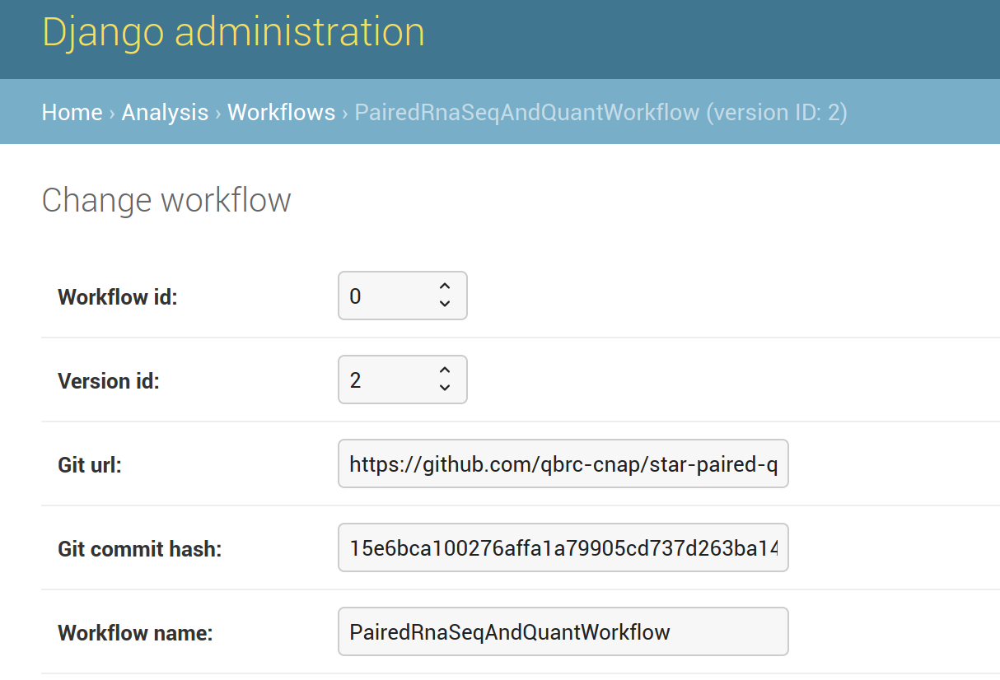

### Reproducing prior analysis on CNAP

This document describes how one might re-produce a prior analysis to ensure consistent processing of data and analyses over time.  This assumes you have administrative privileges for CNAP.

--- 

#### Quickstart

If you know the workflow exists on the current CNAP instance (and which version it is), navigate to the dashboard and create a new analysis project based on the workflow you want.

#### Determining the old analysis version
Find the `workflow_details.txt` from the CNAP process you wish to reproduce.  This is a JSON-format file that has the workflow details required to reproduce both the computing environment (controlled via Docker) and the actual WDL-based analysis (controlled via git).  An example `workflow_details.txt` file is:
```
{
    "docker": {
        "docker.io/blawney/star_quant_only:v0.1": "sha256:c9286647e89cb7c2d885514b451fc598479665d4bb93bccff6838a22089406eb"
    }, 
    "git_repository": "https://github.com/qbrc-cnap/star-paired-quant.git",
    "git_commit": "15e6bca100276affa1a79905cd737d263ba14d33"
}
```
In principle, any changes to the Docker container image (which would change the "digest" hash) should be accompanied by a new commit to the git repository.  Therefore, assuming strict adherence, the git commit ID can serve as the unique identifier for both the workflow *and* the Docker image.  If there was a "rogue" change in the Docker image, the final `workflow_details.txt` will inform you of this, so we can always check that everything remains consistent from run to run. 

#### Finding the same analysis on CNAP
Using the git commit hash, navigate to the admin interface (e.g. https://cnap.tm4.org/admin/) and click on the Workflows table.  This will show analyses currently loaded on the CNAP server.  Usually, you can tell which workflow you want to use, so go ahead on click on that to see more details.  For the example above, we see:


Comparing the git commit hash, we can see that they are indeed the same.  Therefore, we should use the "PairedRnaSeqAndQuantWorkflow", version 2.

**If you cannot find that analysis loaded onto CNAP**
- This is a TODO item.  We can always recover the exact commit manually, but requesting a specific commit via the CNAP dashboard is not currently possible.  This would have to be done manually by cloning the repository, checking out a specific commit, and creating the appropriate database entries (`Workflow` and `WorkflowContainer`).   

**If you cannot tell which analysis you want based on the workflow "name"**

Above, we saw the workflow was named "PairedRnaSeqAndQuantWorkflow", which is derived from the WDL script.  However, in the Django admin it may not be obvious which workflow corresponds to which git repository.  To check that, we start with the git clone url.  In the `workflow_details.txt` above, we see that the github repository is https://github.com/qbrc-cnap/star-paired-quant.git.  Go to that github repo and look at `main.wdl`, which is the required "entrypoint" for all CNAP-based WDLs; the top-level workflow name will tell you which "name" you should choose.  Once you know which name you need, you can look through the commit hashes to find the appropriate version of this workflow (which corresponds 1:1 with a git commit hash).